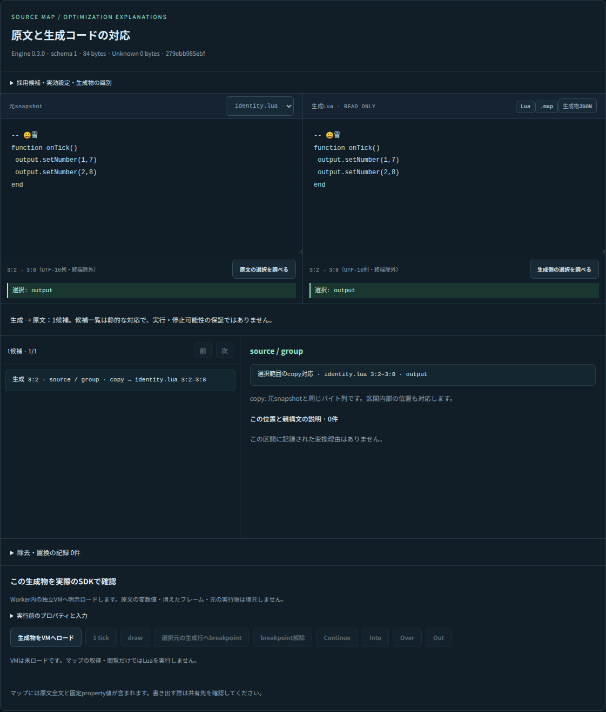

# v0.3.0 P5 — 選択・実停止位置の仕上げと最終利用確認

2026-10-01。実装commit `c851ac3d4f262aa93aae32d3e13b0b3ff397a545`。P5本体の`1d21821`に残っていたidentity/copy範囲の選択を修正し、前の未完了作業を引き継いで確認した。**P0〜P5、CLI/Webの利用検証、保存・持ち運び、互換性棚卸し、検査済み配布物の作成まで完了。性能の追加改善は指示どおり後回し。v0.3.0の公開・本番配備は実施していない。**

[アプリ契約](../specs/playground-source-maps.md) / [P5全体の実装記録](p5-playground-20261001.md) / [今回の機械記録](p5-final-selection-20261001.json)。旧検証の件数は本commitの試験として流用しない。

## 1. 実際に利用できる機能

Playgroundの「Source Map / 最適化を説明する」は、原文と生成Luaの双方向選択、保持された名前・トークン・copy、変換された式・文、Source/Derived/Synthetic/Unknown、複数の関連元、インライン文脈、親構文の理由、除去/置換記録を表示する。生成時に記録されていない理由は推測しない。

「元ファイルへ戻る」では通常/LifeBoatビルドをリンク前の各moduleへ戻す。「停止・ログ・エラー」では、検証済み成果物だけを独立Workerの実VMへ明示ロードし、元範囲から生成行のbreakpoint候補を設定する。tick/draw/continue/into/over/out、入力、stack、ログ、エラーは実SDKの結果を表示する。静的なマップ閲覧だけではLuaを実行しない。

原文はコンパイル時のsnapshot。現在の入力を編集しても過去成果物の原文を変えず、「過去の生成物」として区別する。code/.map/組のartifact JSONを書き出し、再取込時はSDKで内容を検証する。

## 2. 今回完了した修正

### identityとcopyの範囲を、選択した部分だけへ写す

原文をそのまま返す早期終了結果は、ファイル全体が一つのcopy範囲になり得る。以前の生成側問い合わせはその範囲全体を返していたため、6文字を選んでも元のファイル全体へ案内する問題があった。

今回、**SDKが検証した同一バイトのcopy範囲に限り**、生成選択との交差範囲を元ソースへ写す。カーソルは一点、文字選択は選んだ部分、runtimeが返した生成行はその行だけを対象にする。逆引きとの対称性も確認した。

実例は、先頭に`-- 😀雪`がありCRLFで改行した短いLua。3行目の`output`を選ぶと、両欄とも3行2列〜8列（UTF-16、1始まり、終端除外）の6文字だけになる。`output`の途中のカーソルも同じ一点へ戻る。絵文字はUTF-8の4バイトとUTF-16の2単位を混同せず、文字途中を拒否する。

`2*3`を`6`へ変えたような式の由来はcopyではないため、選択が短いことを理由に元の式内部へ線形補間しない。元ファイルの0以外のoffsetを使う複数moduleのコピーも別の実Compilerテストで検証した。

### 読み取り専用欄のキーボード操作

方向キー・Home・End・Shift選択の論理位置を両欄で統一した。サロゲート対の途中へ移動せず、選択を縮めたりアンカーをまたいだりしても方向を維持する。元欄へ同じテキストを再代入してカーソルを末尾へ戻したり、再描画でShiftの選択方向を勝手に前向きへ戻したりしない。

通常の選択・入力欄を編集可能にする変更ではない。Control/Meta/AltのOS固有ショートカットはブラウザーへ委ねる。Unicode scalarと改行に基づく移動であり、全Unicode grapheme clusterやIDEのタブ幅/仮想columnを模倣する機能は追加していない。

### 実停止位置もファイル先頭に戻さない

identity成果物をロードし、原文の出力行へbreakpoint候補を設定して1 tick実行。実際に`suspended`になった後、pauseの位置ボタンを押すと、その出力行だけが対応する。先頭コメントやファイル全体へ誤って戻らないことを3ブラウザーで確認した。

実行環境が返す精度は**生成行のみ・列不明**のまま維持する。詳細mapがあることを理由にPC/実列を推測しない。最小化された1行の複数元位置は候補として示す。削除行に対して近くの実行行を設定しない。

## 3. 保存・持ち運び・CLI

入力、成果物、選択、候補、実行入力と結果をIndexedDBの単一workspace recordへ保存する。identityで6文字だけ選択した状態もリロード後に維持する。復元した実行結果は保存レポートであり、VMはロードしていない状態に戻る。

検証済み6MiB超mapの保存・リロード、新しいブラウザーへのworkspace持ち運び、改ざんしたcode/mapの拒否、旧localStorageの救出、実行中断直後の再実行も確認した。原文・設定・ログに秘密を含めることは可能なので、公開範囲はユーザーが判断する。UIは文字列をtextContent/textareaに表示する。

CLIは`minify FILE --source-map`、`map-inspect ARTIFACT_FILE GENERATED_BYTE`、workspaceの`--project`とJSONL操作を実SDKで検証する。CLIがブラウザーの保存VMを続行したと偽ることはない。保存形式はIndexedDB state version2、portable workspace version1。旧形式を自動移行するコードは追加していない。

## 4. 最終QA

対象flowは、専用route → 16確認例 → マップ作成 → 原文/生成コードの文字・カーソル選択 → 理由・関連元 → 保存/別contextへの持ち運び → 検証済みVMへロード → 実停止/ステップ/ログ/エラーである。

Playwrightでビルド済み`dist-site`を`127.0.0.1`の一時サーバーから配信し、本番と同じ`/tools/stormworks/storm-lua-engine/`を使用した。Browser pluginはこの会話では未提供のため、既存のPlaywrightフローを使った。desktopは1440×1100、mobileは390×844。テスト終了時にサーバーとブラウザーを閉じた。

| 確認 | 結果 |
| --- | --- |
| ページ識別 | titleと専用routeが一致 |
| 初期画面 | 意味のある16例と操作UIを表示。初期表示だけでWASMを起動しない |
| framework overlay | なし |
| console / page error | Chromium・Firefox・WebKitの全試験で0件 |
| スクリーンショット | desktop、identity、runtime、mobileを確認。横方向のページoverflowなし |
| 実操作 | Unicode・caret・Shift・Home・End、双方向、保存・fresh import、実pause/step/log/error、中断が全ブラウザーで成功 |
| 大容量 | Chromiumで6MiB超mapのIndexedDB往復成功、再読み込みでVM未ロード |

## 5. 実行したゲート

| 検査 | 結果 |
| --- | --- |
| Native workspace | **761件成功** |
| SDK型・JS consumer | **30件成功** |
| 実WASM | **81件成功**、独立Lua backend probeも成功 |
| Playground単体/実SDK/CLI | **38件成功**。今回7件を追加、16確認例を含む |
| Runtime/Compilerの3ブラウザー | 成功 |
| Playgroundの3ブラウザー | 全16例とP5専用flowが成功 |
| fmt/default/clippy/rustdoc/architecture/Python/画面契約/ライセンス | 全成功 |
| SDK tarballの独立導入 | 最終tarballを指定したconsumerで成功 |
| 静的ZIP・パス・梱包検査 | 成功 |
| Cloudflare Worker deploy dry-run | 成功。本番へ配備していない |

[GitHub Actions run 36800675476](https://github.com/Stormcat-Works/storm-lua-engine/actions/runs/36800675476)は同じ実装commitに対してLinux・Windows・macOS NativeとWASMの全jobが成功した。WASM jobでも同じPlaygroundブラウザー操作を実行している。

変更はconsumer側の範囲問い合わせ・UIと回帰テストに限る。最適化パス・探索・compilerの形式を変更していない。代表240設定の独立計測は今回再実行しておらず、以前のSDK計測を今回の結果として数えない。全workspace回帰と実WASM/consumerは今回再実行した。性能計測や追加最適化は行わない。

前の未完了作業にWebKitの初期画面待機timeoutが記録されていたが、今回の初回試験と最終ビルド後の再試験では両方とも3ブラウザーが成功した。原因を未確認のまま特定したとは扱わず、失敗を除外するskipや自動retryで合格にしたものではない。

## 6. 成果物・残件の境界

最終revisionに対するSDK tarballと専用route付き静的サイトZIPをローカル検証領域へ保存し、SHA256SUMSとrelease-verification.jsonを作成した。SDK tarballは梱包後の同一ファイルで独立consumerを実行済み。コンパイラを含むWASMと静的サイトの版・revisionを記録する。成果物のhashは本書に対応するJSONへ格納した。

**P5とその後の利用検証・梱包・互換性棚卸しは完了。** 残る公開作業は、管理者の明示的なリリース指示後に行うv0.3.0のGitHub/npm公開・release更新・Playground/ガイドの本番配備である。今回の作業ではmain、release、公開済みv0.2.1の参照と配布物を変更しない。

追加性能最適化、元変数のstorage/lifetime・値の復元、消えた実frame、PC/列、特定loop反復・過去状態の復元は別機能。UIやマップから推測して実装済み扱いにしない。
