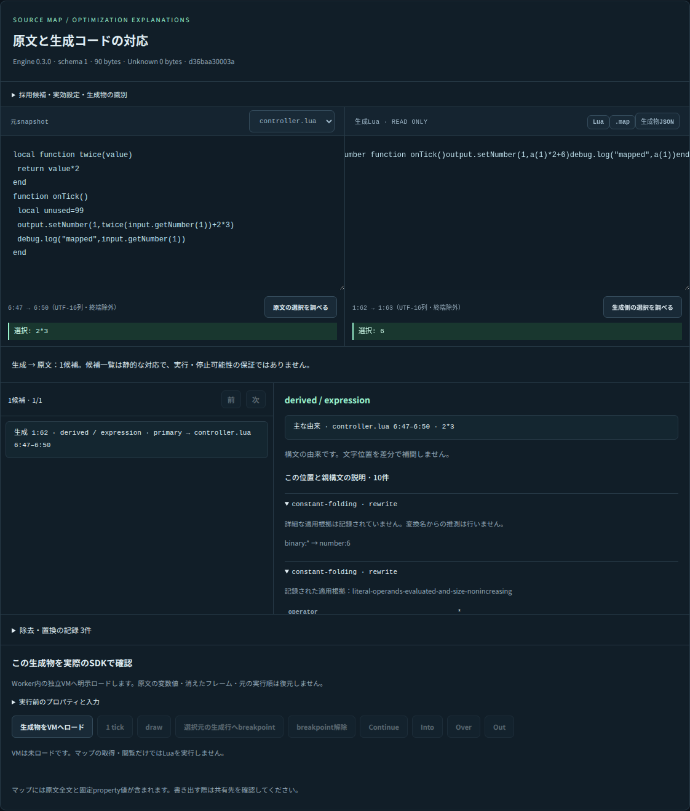
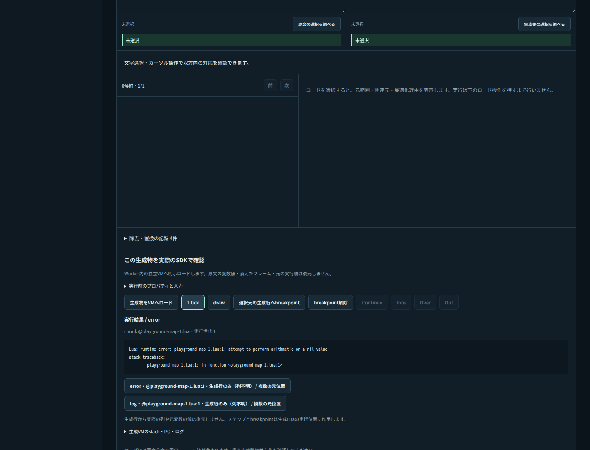

# v0.3.0 P5 — Playgroundの位置検査・実行接続と完成確認

2026-10-01。実装commit `1d21821e563d9169c9bda2f74275a93b6d9e2f8b`。P5の表示・双方向選択・実runtime接続を実装し、後続の契約整理、CLI/Web共通の持ち運び、全ゲート、配布物作成・独立導入確認まで完了した。**追加のコンパイラ性能最適化は指示どおり後回し。v0.3.0の公開や本番配備は実施していない。**

[アプリ仕様](../specs/playground-source-maps.md) / [採用方針](../design/playground-source-map-inspector.md) / [機械記録](p5-playground-20261001.json)。

## 実際に使える操作

Source Map検査パネルには、生成Luaと、マップ作成時の原文snapshotを並べる。文字選択、カーソル移動、キーボード操作、明示の検査ボタンから両方向を検索する。複数の由来は候補として残し、定義・実引数・呼び出し・利用箇所へ個別に移動できる。

保持token/copyと式・文・Groupを区別し、理由のcode/operation/before/after/basis/facts、親construct、inline文脈、除去/置換を表示する。記録された適用根拠がない場合は、その旨を表示する。採用候補・実効設定・producer・内容hashも確認できる。

通常/LifeBoatの複数ファイルは、元moduleのsnapshotを選択して確認する。入力編集後は過去の生成物と明示し、編集中の原文へ古いマップを流用しない。生成Lua/.mapと組のJSONを書き出せる。コードとmapが合わないインポートは既存の入力・成果物を保ったまま拒否する。

## 実VMへの接続

「生成物をVMへロード」は、検証済みのコード/mapの組を独立Worker内のSDK VMへロードする。コンパイルや閲覧だけではLuaを実行しない。生成物のintegrity、chunk名、ロード世代を固定し、別のmapを用いた実行要求を拒否する。

元範囲から生成行breakpoint候補を設定し、実際にsuspendedしたこと、into/over/out/continue、tick、draw、I/O、ログ、エラーを確認できる。行しか取得できない場所では列を作らず、同じ生成行に対応する元範囲をすべて候補として表示する。最小化した1行から元の複数行へ戻るケースも、単一の行へ決めつけない。

生成VMのstackは生成後の実フレームである。元変数の値・消えたフレーム・生成loopの特定反復・bytecode PCを復元したとは表示しない。runtimeからchunkや位置を取得できなかった情報は、元のエラーメッセージを維持する。

## 保存・復元・CLI

大きなmapも含め、入力・成果物・選択・候補・実行入力・結果をIndexedDBの単一recordへ保存する。実行結果の復元はVM継続ではなく、「保存結果・VMは未ロード」と表示する。元のlocalStorage形式は自動移行せず、壊れた/未対応の保存データを救出してから入力を戻す。

workspace JSONはproject、inspection、history、frameを持つ。CLI/Webで同じ型・検証を共有し、新しいブラウザーへ持ち込んでも生成物と選択を復元できる。従来の入力だけのproject JSONも、独立した既知の形式として読み込める。サイレントな状態変換はない。

CLIは`minify FILE --source-map`、`map-inspect ARTIFACT_FILE GENERATED_BYTE`、`--project WORKSPACE_FILE`に対応する。JSONLにもmap検査・生成物load・実行操作を追加した。CLIでworkspaceを実行する場合は新規sessionの操作列を実行し、保存していたVMを継続しない。

## 発見して修正した利用側の不具合

- 関数全体の元範囲へ帰属した括弧等が、削除済みlocalの逆引き候補にも出ていた。選択を含む細かい元範囲と明示的dispositionを優先し、削除された行を実行可能として提示しないようにした。
- 実行中断直後の新規実行へ、古い非同期initializerが侵入する競合を修正した。マップ生成・ファイル読取・検証後にも世代を確認し、古い結果が新しい生成物を上書きしない。
- textareaのCRLF正規化とUTF-16選択を、そのままUTF-8の元範囲と混同しない。別座標を明示変換し、文字途中を拒否する。
- 成果物切り替え後に古い座標表示が残らないようにし、フォーカスを移しても選択された短い原文/生成文を可視表示する。

これらはconsumer側の実装で、最適化パスや候補探索を変更していない。

## 検証結果

| 検査 | 結果 |
| --- | --- |
| Native workspace | 761件成功 |
| SDK型/JS | 30件成功 |
| 実WASM | 81件成功、独立Lua backendも成功 |
| Playground | 31件成功、16確認例を実SDKで実行 |
| 代表30入力・Native240設定 | 理由付きmap ON/OFFと変更前の生成Lua一致、全件Unknown 0 |
| Native目標未達 | 240比較で最大探索と生成Lua・由来が一致 |
| WASM代表設定 | 240設定＋未達30件、実validator・元snapshot hash・生成Lua一致 |
| Chromium/Firefox/WebKit | 全16例、Source Map双方向選択・理由・inline文脈・元module・保存・fresh import・実pause/step/log/error・中断成功 |
| 大容量保存 | Chromiumで6MiB超の検証済みmap生成物をIndexedDBへ保存・reload、VM未起動を確認 |
| 不完全な入力map | 意図的にUnknownを残したインポートmapをSDKで検証し、UIがUnknownを偽の元位置で埋めないことを確認 |
| UI確認 | デスクトップ・390px幅のスクリーンショットを確認。横overflowと新しいconsole errorなし |
| 配布物 | SDK tarballを独立環境へ導入して実行、静的ZIP作成、path/ライセンス検査成功 |
| Worker配備検査 | dry-run成功。本番配備ではない |
| fmt/default/clippy/rustdoc/architecture/Python | 全成功 |

[GitHub CI 36791290985](https://github.com/Stormcat-Works/storm-lua-engine/actions/runs/36791290985)は、同じ実装commitのLinux/Windows/macOS NativeとWASM全jobで成功した。WASM jobでも同じPlaygroundブラウザー検証を実行する。

各旧版の件数を現在の検証として流用せず、今回のログ・exit code・SDK/アプリの実行結果を保存した。部分mapのUI検証は意図的に作成した有効な未帰属mapであり、現行コンパイラが代表240設定でUnknownを生成したという意味ではない。

## 互換性とリリース前の棚卸し

| 対象 | v0.3.0の扱い |
| --- | --- |
| npmの通常minify/build | mapは明示指定。従来の非map経路を維持 |
| Source Map | 標準version3＋x_storm schema1。エンジン版・成果物指紋とは別 |
| 内部candidate/Worker binary | 同じcompiler版同士で使用。0.2.1との混用を保証しない |
| 低レベルRust AST | NodeArena対応が必要。単なるVec構築consumerは要更新 |
| runtime/Composite I/O/描画/savedata | 今回のP5変更なし。既存回帰を再実行 |
| 端末のPlayground保存 | IndexedDB state version2。旧localStorageを暗黙移行しない |
| export/import | workspace version1を追加。入力project version1も受理 |
| 下流のStorm Code/Editor採用 | 各consumerの責務。今回の完了に全製品移行を抱き合わせない |

SDK tarballと静的サイトZIPはローカル検証領域で固定した。ファイル名・SHA-256は機械記録へ保存する。公開時は対象commit・CHANGELOG・タグ・ガイドと本番配備を別の明示的な公開工程として行い、検査済み成果物を公開後に差し替えない。

## 残すものと完了したもの

**計画のP0〜P5、アプリ/CLI接続、利用例、検証・梱包・互換性棚卸しは完了。** 追加の性能最適化は保留した。全67パスのすべての根拠を形式的証明として追加収集すること、複雑な変数復元、履歴実行などは別機能であり、P5の穴を埋めるfallbackとして実装しない。

v0.3.0のnpm公開、GitHub Release作成、releaseブランチ更新、本番Playground/公開ガイド配備は実施していない。main、release、公開済みv0.2.1のタグと配布物は固定したまま。作業は専用ブランチへ保存する。
